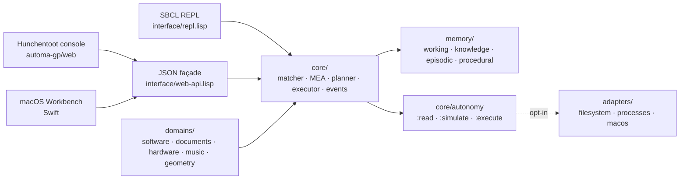

<p align="center">
  
</p>

<p align="center">
  <picture>
    <source media="(prefers-color-scheme: dark)" srcset="assets/img/automa-gp-logo-dark.svg">
    
  </picture>
</p>

<p align="center">
  <strong>A symbolic planner that lives on your own computer.</strong><br>
  Means-Ends Analysis in Common Lisp, with memory, explanation, and a policy gate before anything runs.
</p>

<p align="center">
  <a href="https://github.com/gpicchiarelli/AutomaGP/actions/workflows/ci.yml"></a>
  <a href="https://github.com/gpicchiarelli/AutomaGP/actions/workflows/ci.yml"></a>
  <a href="https://github.com/gpicchiarelli/AutomaGP/actions/workflows/lint.yml"></a>
  <a href="https://github.com/gpicchiarelli/AutomaGP/actions/workflows/macos-workbench.yml"></a>
  <a href="https://github.com/gpicchiarelli/AutomaGP/actions/workflows/codeql.yml"></a>
  <a href="LICENSE"></a>
  <a href="version.lisp"></a>
  <a href="automa-gp.asd"></a>
  <a href="adapters"></a>
  <a href="tests"></a>
  <a href="https://github.com/gpicchiarelli/AutomaGP/commits/main"></a>
</p>

<p align="center">
  <a href="#what-it-is">What it is</a> ·
  <a href="#thirty-seconds">Thirty seconds</a> ·
  <a href="#architecture">Architecture</a> ·
  <a href="#memory-and-the-procedure-archive">Memory</a> ·
  <a href="#events-and-autonomy">Autonomy</a> ·
  <a href="#adapters-and-what-stays-out-of-reach">Limits</a> ·
  <a href="#install-and-run">Install</a> ·
  <a href="docs/architecture.md">Docs</a>
</p>

<br>

## What it is

AUTOMA GP takes a context made of symbolic facts, a set of goals, and a set of operators with preconditions and effects. It finds the differences between what holds and what is wanted, picks operators that close those differences, and builds a plan. The plan can be simulated on a copy of the facts or executed on the live ones. Every decision is recorded in a trace that `gp-explain` reads back. Successful plans can be stored as procedures, scored over time, and reused instead of searching again.

The system runs in an SBCL REPL and is complete there. A small Hunchentoot server exposes the same session as JSON, and a native macOS window sits on top of that server. Nothing in the project is a chatbot, a language model, or a script runner. It is a deliberative loop in the tradition of Newell and Simon's GPS and Norvig's *Paradigms of Artificial Intelligence Programming*, written for one person's machine.

## Thirty seconds

Load the system, load a domain, plan, simulate, execute, and ask why.

```lisp
(ql:quickload :automa-gp)
(in-package :automa-gp)

(gp-reset)
(gp-load-domain :hardware :seed-demo t)          ; device interface-01, power off
(gp-plan :goals '((device-configured interface-01)))
;; => plan: power-on-device → connect-device → configure-device

(gp-simulate)                                   ; runs on a copy; facts untouched
(gp-run)                                        ; applies the effects to the context
(gp-facts)                                      ; (device-configured interface-01) now holds
(gp-explain)                                    ; what was tried, in which order, and why
```

`gp-run` changes symbolic facts only. Touching the computer needs `(gp-run :adapters t)`, and even then only operators that carry an explicit `:external` spec reach an adapter. See [Adapters and what stays out of reach](#adapters-and-what-stays-out-of-reach).

## Architecture



The core is ANSI Common Lisp plus UIOP. Pattern matching and unification support rules and queries. Means-Ends Analysis turns goal differences into subgoals and operator applications. The executor applies a plan in `:SIMULATE` mode on a copy of the facts or in `:EXECUTE` mode on the live context, and signals conditions with restarts when a precondition fails. A deliberative trace records each phase and feeds `gp-explain` and the Italian narration in `gp-narrate`.

Three surfaces reach the same session. The REPL is primary. The JSON façade in `interface/web-api.lisp` is pure Lisp and is tested without a socket. The optional `automa-gp/web` system puts Hunchentoot in front of it, and the Swift Workbench talks to that server.

## Memory and the procedure archive

Four memory layers sit beside the context. Working memory is a snapshot of the current facts, goals, and mode. Knowledge memory holds durable facts and rules that can be merged into a context. Episodic memory records plans and executions with their outcome. Procedural memory stores successful plans as named procedures with a success and failure count. `gp-save` and `gp-load` write and read the whole bundle as readable s-expressions in `.agp` files (the default type when a path has no extension).

The procedure archive is the part that learns. `gp-remember-procedure` stores the last successful plan under a name and writes the archive to `~/.automa-gp/procedure-archive.agp`. An unsuccessful plan is refused before the archive is touched. `gp-plan` consults that archive before searching: an exact goal match comes first, then a procedure whose goals include the request, then a combination of procedures that each cover a part of it. Steps whose extra goals cannot be restored are left aside and a search fills the gap. When a stored step meets a missing precondition, the planner repairs it with other archived procedures, up to sixty-one levels deep, and falls back to plain Means-Ends Analysis past that. A live `gp-run` of a reused procedure updates its score. Simulation leaves the score alone.

```lisp
(gp-remember-procedure :name 'configure-interface)   ; store and autosave
(gp-archive)                                         ; highest score first
(gp-plan :goals '((device-configured interface-01))) ; archive first, then MEA
(gp-use-procedure :name 'configure-interface)        ; replay without search
(gp-score-procedure 'configure-interface :success t) ; manual feedback
```

## Events and autonomy

Events are facts with a lifecycle. `gp-emit` records an event on the context. `gp-react` matches pending events against registered reactions, which assert facts and add goals. Goal-directed planning and event-driven reaction coexist in the same loop.

Autonomy is one controlled cycle: react to pending events, plan for open goals, then simulate or execute according to the policy. The policy has three authorities. `:READ` observes and plans. `:SIMULATE`, the default, also runs the plan on a copy of the facts. `:EXECUTE` changes the live context and still asks for confirmation on high-risk or irreversible operators unless the policy says `:auto-confirm t`. Adapters stay off until the policy enables them.

```lisp
(gp-reset)
(gp-load-domain :documents)
(gp-emit '(file-created "document.pdf"))    ; pending event
(gp-policy :authority :simulate)            ; safe default
(gp-autonomous-step)                        ; react → plan → simulate
(gp-last-autonomy)

;; Idle context (no open goal, no pending event) is refused:
;; (gp-autonomous-step) → error; last autonomy stays as it was.

;; Live mutation needs an explicit policy:
(gp-policy :authority :execute :auto-confirm t :adapters nil)
(gp-autonomous-loop :max-steps 4)
```

A family of *notice* functions brings observations from the machine into the context without running anything. `gp-notice-path` asserts one existing file as `(file-created path)` when a reaction already models that event. `gp-notice-directory` does the same for the files under a directory. `gp-notice-processes`, `gp-notice-terminals`, `gp-notice-terminal-text`, and `gp-notice-terminal-screen` look for processes, open ttys, text in a transcript file, and text on a Terminal.app tab that a reaction already names. Each has a `gp-watch-…` form that repeats the look on an interval until its `gp-stop-…` or `gp-reset`. `gp-plan-open-goals` then plans for the unsatisfied goals those reactions recorded; goals that already hold are not planned.

`gp-ask` reads a short Italian phrase such as `voglio power-state interface-01 on` and turns it into a goal when the shape already exists in the context, an operator, a reaction, or a rule. An operator can declare words it answers to (`accendi` on `power-on-device`), and `gp-name-operator` adds more. Anything the context does not already model is refused with the candidates named. A phrase whose goal already holds is refused without recording it or replacing the plan.

## Adapters and what stays out of reach

Three adapters exist. `filesystem` probes, reads, writes, and deletes files and creates directories. `processes` runs a program and checks whether a pid or a process name is alive. `macos` calls `open`, `hostname`, and `uname`. An operator reaches an adapter only through an `:external` spec in its meta, and only when `*invoke-adapters*` is true for that execute. Before anything runs, `plan-external-actions` names the actions a plan would hand to an adapter, and an execute refuses, with or without adapters, when those actions no longer ground the same way or the facts no longer support them. A simulation refuses the same way, before any simulated step. That refusal happens before any fact changes, so the symbolic effect is not applied and an earlier step is not applied. The goal stays open until a new plan records the action as it is now. An autonomous execute or simulate halts on that refusal instead of signaling, and the loop does not take another step.

The rest is stated plainly so the README stays a faithful picture.

- Watches are polling loops on an interval. There is no FSEvents, kqueue, or launchd hook, and a watch only records what a registered reaction already names.
- The Terminal.app screen look reads tab text through `osascript` and stops there. Nothing types, clicks, or uses the Accessibility API. There is no GUI automation.
- Domain packs are symbolic operator chains. `compile-project` in the software domain runs `true`; `archive-document` writes a marker file when a path is given. They exercise the planner and nothing else.
- A replayed procedure runs its recorded external action only on a confirmed execute with adapters, and only when the operator is still the one recorded. A step whose operator is gone applies its stored effects and invents no command. A step whose preconditions no longer hold is withheld.
- `gp-ask` knows a small vocabulary shaped by the goals already in the context. It is an entry point for a goal and nothing more.
- The web server binds `127.0.0.1` and has no authentication. It is meant for the same machine.

## Domains

Each domain pack installs operators, rules, and sometimes reactions into the current context. `:seed-demo t` adds a starting fact or two so a plan can be built at once.

| Domain | Chain | Notes |
| --- | --- | --- |
| `:hardware` | power on → connect → configure | `power-on-device` answers to `accendi` in `gp-ask` |
| `:documents` | ingest → classify → archive | reaction on `(file-created ?path)`; optional `:archive-path` gives `archive-document` a real file to write |
| `:software` | repository → compile → test | `compile-project` carries an `:external` spec that runs `true` |
| `:music` | interface → MIDI route → session | symbolic only |
| `:geometry` | points → segments → triangle | symbolic only |

`(gp-load-domain :hardware :seed-demo t)` installs one; `(gp-domains)` lists what the context carries.

## Web API and macOS Workbench

`./scripts/run-web.sh` starts Hunchentoot on `http://127.0.0.1:47391/` with a small operator console. Every route is a thin call into the same session the REPL uses.

| Method | Routes |
| --- | --- |
| `GET` | `/api/status` · `/api/context` · `/api/facts` · `/api/goals` · `/api/operators` · `/api/rules` · `/api/events` · `/api/reactions` · `/api/plan` · `/api/execution` · `/api/explain` · `/api/reaction` · `/api/autonomy` · `/api/archive` · `/api/archive?applies=1` |
| `POST` | `/api/reset` · `/api/add-fact` · `/api/remove-fact` · `/api/add-goal` · `/api/load-domain` · `/api/plan` · `/api/plan-open-goals` · `/api/simulate` · `/api/run` · `/api/emit` · `/api/react` · `/api/ask` · `/api/listen` · `/api/induce` · `/api/induce/rule` · `/api/induce/note` · `/api/operator/name` |
| `POST` | `/api/notice-path` · `/api/notice-directory` · `/api/notice-processes` · `/api/notice-terminals` · `/api/notice-terminal-text` · `/api/notice-terminal-screen` · `/api/watch-*` · `/api/watch-*/stop` |
| `POST` | `/api/archive/remember` · `/api/archive/use` · `/api/archive/score` · `/api/autonomy/policy` · `/api/autonomy/step` · `/api/autonomy/loop` |

The Workbench in [`macos/AutomaGPWorkbench`](macos/AutomaGPWorkbench) is a SwiftPM app for macOS 13 and later. It leads with one next step: while a plan is incomplete, edit the facts and induce an operator from the before and after; otherwise simulate, and confirm before execute. Simula and Esegui stay disabled until status reports a successful plan. It can also take one autonomous step or a bounded autonomous loop: with authority simulate, Passo and Ciclo only simulate; with authority execute, Passo… and Ciclo… ask for confirmation before adapters may run. Limite ciclo sets how many steps Ciclo may take. Passo and Ciclo stay disabled when status shows neither open goals nor pending events. The last autonomous outcome stays under those controls after a refresh. Pianifica follows open goals from status, not the raw goal count, and captions pending events when any wait. The narrated trace stays folded under the plan. It shows the external actions a confirmed execute would run, and says which were withheld.

```bash
./scripts/run-web.sh
cd macos/AutomaGPWorkbench && swift run
```

## Install and run

You need SBCL and Quicklisp. On macOS, `brew install sbcl` and the [Quicklisp installer](https://www.quicklisp.org/beta/) are enough. The scripts symlink this checkout into `~/quicklisp/local-projects/automa-gp` on first run.

```bash
git clone https://github.com/gpicchiarelli/AutomaGP.git
cd AutomaGP
./scripts/run-tests.sh      # FiveAM suite: 358 tests, 5107 checks
./scripts/run-web.sh        # operator console on http://127.0.0.1:47391/
```

From a REPL, or from SLIME or SLY:

```lisp
(ql:quickload :automa-gp)          ; core, no web dependency
(ql:quickload :automa-gp/web)      ; adds Hunchentoot
(in-package :automa-gp)
(gp-reset)
```

Dependencies stay small on purpose. The core needs ANSI CL, ASDF, and UIOP. The web system adds Hunchentoot. Tests add FiveAM. The Workbench needs Xcode command line tools for `swift run`. CI runs the same suite on Ubuntu, macOS, and FreeBSD 14.x, so the core is portable; the `macos` adapter and the Terminal.app look are the parts that need a Mac. Day-to-day wrappers live in the root `Makefile` (`make test`, `make load`, `make web`, `make lint`).

## Repository layout

| Path | Contents |
| --- | --- |
| [`core`](core) | Context, facts, matcher, unification, rules, queries, operators, MEA, planner, executor, conditions, trace, events, induction, autonomy |
| [`memory`](memory) | Working, knowledge, episodic, procedural memory and `.agp` s-expression persistence |
| [`adapters`](adapters) | Filesystem, processes, and macOS adapters; external-action naming and refusal |
| [`domains`](domains) | Five domain packs and the `gp-load-domain` registry |
| [`interface`](interface) | REPL commands, notice and watch, `gp-ask`, narration, JSON, the web API façade, and the Hunchentoot console |
| [`macos/AutomaGPWorkbench`](macos/AutomaGPWorkbench) | Native SwiftUI shell over the JSON API |
| [`tests`](tests) | FiveAM suite, one file per component |
| [`scripts`](scripts) | `run-tests.sh`, `run-tests.lisp`, `run-web.sh` |
| [`docs`](docs) | [Architecture](docs/architecture.md), the [master prompt](docs/PROMPT.md), and two worked REPL setups |
| [`examples`](examples) | Loadable versions of those worked setups |
| [`assets/img`](assets/img) | Hero image and logo |

## Roadmap and status

The twelve phases in [`ROADMAP.md`](ROADMAP.md) are delivered: context, matching, Means-Ends Analysis, execution, conditions, explanation, memory, adapters, domains, events, web, and policy-gated autonomy. Everything after that is deepening, one small tested increment per version. The most recent series is about external actions and the workbench gate around them: a plan names the adapter actions it would run, execute and simulate refuse when those actions changed or the facts no longer support them, and the workbench can take one autonomous step or a bounded loop, set that bound, keep showing the last outcome, read open goals and pending events from status, keep Passo and Ciclo idle when neither remains, refuse the same idle call from the REPL and HTTP API, refuse Pianifica and `gp-plan` when no goal is still open, keep Simula and Esegui idle until a successful plan exists, end plan-failed listening when archive use rebuilds a successful plan, refuse Ask or add-goal when the goal already holds, refuse induce without an active listening session, refuse remember without a successful plan, keep the HTML operator console’s Simulate and Run idle under the same external-match and support rules as the workbench, keep Remember, Step, and Loop idle under the same readiness rules, keep Plan idle until an open goal exists or Goals JSON is typed, keep Plan idle when that typed JSON already holds, keep Use/Score idle without a matching archived procedure, keep React idle without a pending event, keep Use idle when an archived procedure does not apply to the current facts, keep Emit and Add fact idle until Event/Fact JSON is a non-empty array, and request archive `applies` only when gating Use so listing stays cheap, with applies probes cached across identical fact snapshots and cleared on reset. `version.lisp` holds the current number and [`CHANGELOG.md`](CHANGELOG.md) has one entry per version.

Priority is correctness, then clarity, then testability, then performance.

## Contributing

Read [`CONTRIBUTING.md`](CONTRIBUTING.md). Keep the system loadable and the tests green, add a FiveAM test with each change, and keep the README, roadmap, and changelog faithful to what the code does. Announce a capability only when it is loadable and tested. Security reports go through [`.github/SECURITY.md`](.github/SECURITY.md). Italian and English are both welcome.

## Citation

If you use AUTOMA GP in academic work, please cite [`CITATION.cff`](CITATION.cff).

## License

AUTOMA GP is released under the [BSD 2-Clause license](LICENSE). Copyright (c) 2026 Giacomo Picchiarelli.
